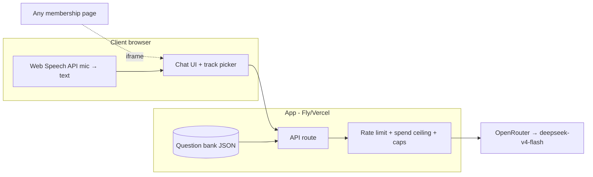
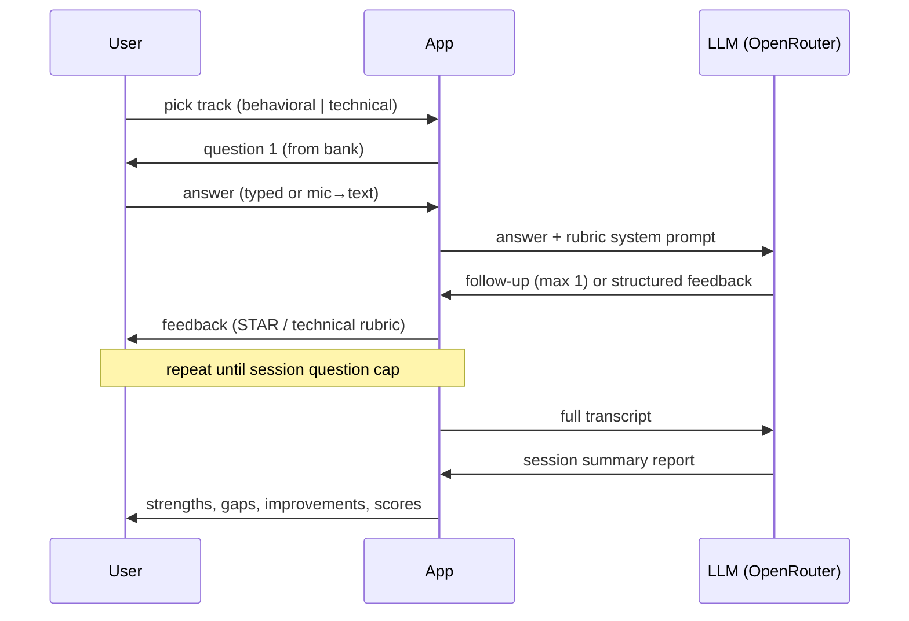

# Interviewer Chatbot — Build Spec (demo scope)

**What gets built:** a standalone web app that runs a mock job interview — AI interviewer asks questions from a question bank, user answers by typing or speaking, gets structured feedback per answer and an end-of-session summary. Demoable end-to-end at a public URL; not production-hardened beyond protecting the API key.

Standalone by design, iframe-embeddable — so it stays independent of any membership platform (Podia/Circle both take embeds). Decided 2026-08-17; two-way door.

## Core flows

1. **Track selection** — Behavioral or Technical.
2. **Interview loop** — question from the bank → user answers (typed, or mic via browser Web Speech API) → at most one natural follow-up → structured feedback → next question.
3. **Feedback per answer**
   - Behavioral: STAR rubric (Situation / Task / Action / Result), specificity and impact called out.
   - Technical: correctness / approach / communication rubric.
4. **Session summary** — strengths, gaps, concrete improvements, per-question scores. Session ends at a question cap.

## Question bank

Seeded sample bank (realistic behavioral + technical questions) in a simple data file (JSON: track, question, optional rubric hints) so a different bank can drop in later.

## AI

- OpenRouter (OpenAI-compatible chat completions), so the model is swappable per deployment. Default: `deepseek/deepseek-v4-flash` (~$0.08/M input, $0.17/M output — a full 4-question session costs ~$0.002); override with the `MODEL` env var (e.g. `xiaomi/mimo-v2.5`, or a Claude model for a client who wants it). `OPENROUTER_API_KEY` in `.env`, never committed.
- Provider routing sorted by throughput (`provider.sort`), 45s timeout + one retry — the cheapest providers for these models are sometimes 60s+ slow, and some occasionally return empty content.
- Interviewer behavior in a system prompt: questions only from the bank, one follow-up max, feedback strictly in rubric structure (JSON), no open-ended chat mode. Malformed JSON falls back to showing raw text as the coach comment.

## Voice

- **In scope:** spoken *input* only — browser Web Speech API, free, no services.
- **Out of scope:** spoken interviewer (STT+TTS or real-time voice agent). Deferred: all-in voice-agent costs ~$0.07–$0.40/min (researched 2026-08-17) make long mock interviews uneconomic for a $15–29/mo membership; not needed to demo the product.

## Abuse protection (required — public link burns a real key)

- In-memory per-IP sliding-window rate limit (20 req / 5 min) — zero-dep, fine for a single-instance demo. (Arcjet considered; not needed at this scale.)
- Hard process-wide spend ceiling: `SPEND_LIMIT_USD` (default $0.50) — tracked from OpenRouter's per-call cost field; API returns 503 when exhausted.
- Per-session caps: 4 questions, bounded max_tokens per call, 4000-char answer limit, 64KB request bodies, sessions evicted after 1h.

## Hosting

Free tier on Fly (if CLI still authed from caniparkhere) else Vercel/Cloudflare with a token from Emily.

## Explicitly not building

- Membership site, Stripe, email automation, analytics (client-account configuration, post-award work).
- User accounts / saved session history — demo is stateless per session.

## Definition of done

URL driven end-to-end in a real browser: full interview through feedback cards and session report. "Code written" ≠ done.

**Verified locally 2026-08-17** (headless Chromium): track select → questions → typed answers → follow-up → rubric feedback cards → structured session report; zero console errors; total test spend $0.005. **Unverified:** live mic transcription (Web Speech API needs a real headed browser with mic permission — button renders and wires up; Emily to sanity-check once by voice) and the deployed environment (not yet deployed).

## Architecture

## Session lifecycle

## Open questions (running list)

- Question-bank format a real client would supply — confirm if/when awarded.
- Saved session history for members — post-award question, not demo.
