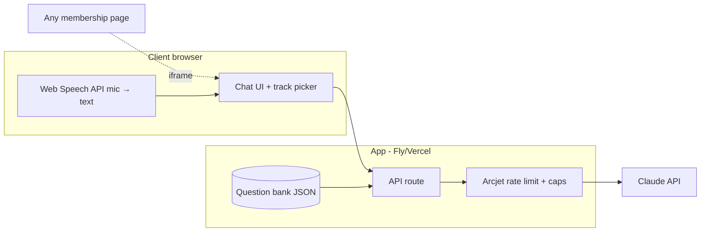
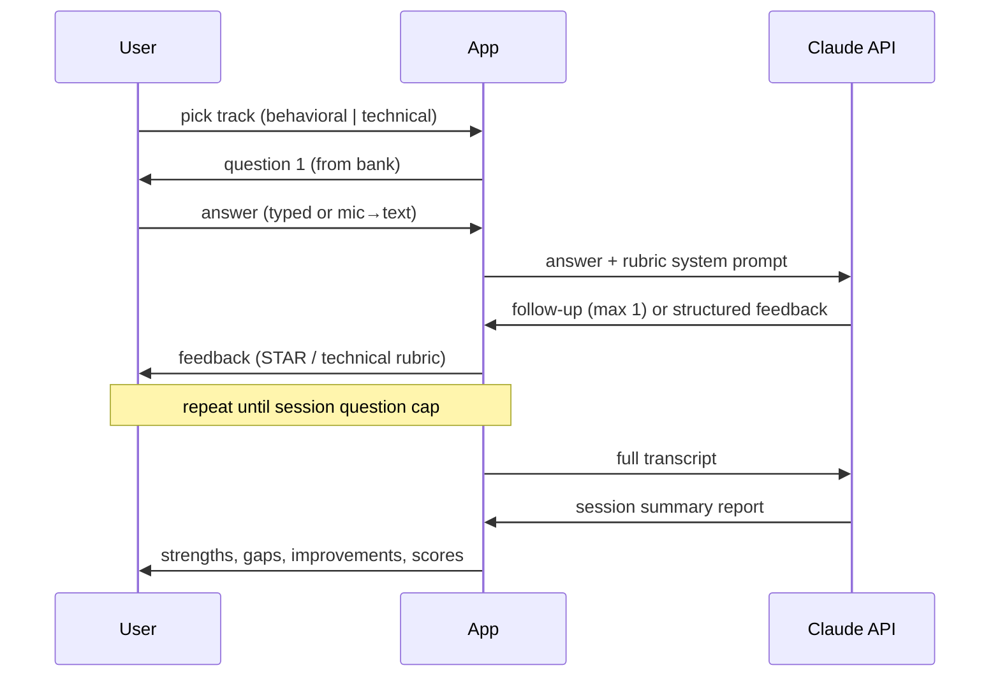

# Interviewer Chatbot — Build Spec (demo scope)

**What gets built:** a standalone web app that runs a mock job interview — AI interviewer asks questions from a question bank, user answers by typing or speaking, gets structured feedback per answer and an end-of-session summary. Demoable end-to-end at a public URL; not production-hardened beyond protecting the API key.

Standalone by design, iframe-embeddable — so it stays independent of any membership platform (Podia/Circle both take embeds). Decided 2026-08-17; two-way door.

## Core flows

1. **Track selection** — Behavioral or Technical.
2. **Interview loop** — question from the bank → user answers (typed, or mic via browser Web Speech API) → at most one natural follow-up → structured feedback → next question.
3. **Feedback per answer**
   - Behavioral: STAR rubric (Situation / Task / Action / Result), specificity and impact called out.
   - Technical: correctness / approach / communication rubric.
4. **Session summary** — strengths, gaps, concrete improvements, per-question scores. Session ends at a question cap.

## Question bank

Seeded sample bank (realistic behavioral + technical questions) in a simple data file (JSON: track, question, optional rubric hints) so a different bank can drop in later.

## AI

- Claude API. Key in `.env`, never committed.
- Interviewer behavior in a system prompt: questions only from the bank, one follow-up max, feedback strictly in rubric structure, no open-ended chat mode.
- Model choice / streaming / token budgets decided at build time against current Claude API docs, not from memory.

## Voice

- **In scope:** spoken *input* only — browser Web Speech API, free, no services.
- **Out of scope:** spoken interviewer (STT+TTS or real-time voice agent). Deferred: all-in voice-agent costs ~$0.07–$0.40/min (researched 2026-08-17) make long mock interviews uneconomic for a $15–29/mo membership; not needed to demo the product.

## Abuse protection (required — public link burns a real key)

- Arcjet rate limiting (Emily's existing setup).
- Per-session caps: max questions, max tokens per response, short context window.

## Hosting

Free tier on Fly (if CLI still authed from caniparkhere) else Vercel/Cloudflare with a token from Emily.

## Explicitly not building

- Membership site, Stripe, email automation, analytics (client-account configuration, post-award work).
- User accounts / saved session history — demo is stateless per session.

## Definition of done

Deployed URL driven end-to-end in a real browser: full interview on both tracks, mic input observed working, rate limit observed firing. "Code written" ≠ done.

## Architecture

## Session lifecycle

## Open questions (running list)

- Question-bank format a real client would supply — confirm if/when awarded.
- Saved session history for members — post-award question, not demo.
